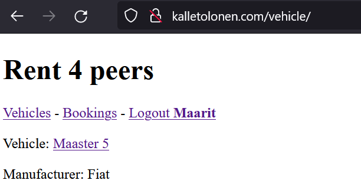

## Rent4peers
A repo for developing peer renting software with Django.



Made by:
https://www.linkedin.com/in/kalletolonen/

Demo (you can register if you'd like to):
http://kalletolonen.com/vehicle/

Maturity:
Early Beta

Made for this course:
https://terokarvinen.com/2021/python-web-service-from-idea-to-production-2022/

Business purpose:
Software for peer rentals of RV's and other vehicles.

## How to install
Rquirerements:
Debian 11 or similar
Django 3.2

```
sudo apt-get update
sudo apt-get install -y git
git clone https://github.com/kalletolonen/rent4peers.git
cd rent4peers
source env/bin/activate
cd rent4peers
./manage.py
navigate to localhost:8000/vehicle/
```

## ToDo's

**Models**
- Renter can set renting terms: minimum rent period, day price & pre-set car properties (travel outside host country, pets, 230-v electricity, navigation, etc. ) STARTED
- Comments for renter and vehicles 

**User auth**
- Login for customers & renters & admin DONE

**Views**
- Booking calendar for vehicles 
- Renter can get easy total sums of key metrics 
- Customer can view their rents and key metrics 
- Peer reviews for renters and customers (Confirmed rent from the renter required) 
- Search for customers (user sets date of travel & budget + more properties if needed) 

**Prices**
- An individual price calendar for each vehicle (day price (week price is calculated from that)) STARTED

**Confirmations**
- Email confirmations 

**Paymment integration**
- Renter gives an account number 
- Rentee makes payment -> a reservation is populated 
- Operator takes  a cut for the service that's provided 
